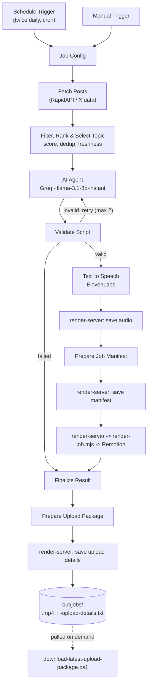

# End-to-End AI Content Production System

An automated pipeline that turns a live trending topic into a finished, narrated vertical video — from content discovery to a packaged, downloadable MP4.

## Demo

[Watch a sample output](docs/demo-video.mp4) — generated end-to-end by the pipeline: trend selection, script generation, ElevenLabs narration, and Remotion rendering, with no manual editing afterward.

## Overview

This project automates the production side of short-form video content: it finds a worthwhile topic, writes and validates a script with an LLM, generates narration audio, and renders a fully animated video through a custom Remotion engine. Orchestration runs in n8n; the ranking logic, script validation, and the video renderer itself are custom code.

The currently deployed instance sources cryptocurrency/market content — that's the niche it was built for, and the workflow's search queries, scoring keywords, and LLM prompt reflect that. The core architecture (trend scoring and dedup, LLM validation, deterministic script-to-video rendering) isn't crypto-specific and can be adapted to other structured content domains, but that adaptation isn't done for you out of the box.

Publishing is intentionally outside the system. A run ends with a rendered MP4 and a pre-filled upload-metadata file sitting in an output folder, plus a small script to pull that package down for a human to review and upload manually.

## How it works

1. **Scheduled content discovery** — a cron (or manual) trigger in n8n kicks off a job and fetches recent posts from a third-party data API.
2. **Filtering, freshness, dedup and ranking** — posts are cleaned of spam/engagement bait, checked against recent history, bucketed by freshness, and scored on engagement, velocity, recency, and corroboration.
3. **Topic selection** — the highest-scoring fresh candidate wins; if nothing clears the bar, a curated evergreen topic is used instead.
4. **LLM script generation + validation** — Groq writes a short script under a strict prompt; a code step re-validates word count, banned phrases, and formatting, retrying the LLM a bounded number of times on failure.
5. **ElevenLabs narration** — the validated script is converted to narration audio.
6. **Job/manifest handoff** — the audio and a job manifest are handed to a small render service running alongside this Remotion project.
7. **Remotion video generation** — the script is broken into timed beats, each classified into a visual, and rendered against the narration's real measured duration.
8. **Output validation and packaging** — the rendered MP4 is validated (dimensions, fps, audio, duration), then bundled with a pre-written upload-metadata file into a downloadable package.

## Architecture



Everything left of `render-server` is n8n orchestration. Everything at and right of it — the render service, lock/retry/validation logic, and the Remotion engine — is this repository's own code. There's no node in this graph that publishes anywhere; the pipeline stops at a packaged local output.

## Engineering highlights

- **Content ranking, freshness and dedup** ahead of generation, so the same story never gets used twice and stale posts don't win — `workflow/content-production-workflow.json`.
- **LLM output validation with bounded retries** — script generations are re-parsed and re-checked against the same rules the prompt asked for, not trusted as-is.
- **An n8n ↔ host render-service bridge** — a small token-authenticated HTTP service is the single authoritative writer for job files, replacing an earlier design where a containerized workflow wrote directly to a bind-mounted folder — `scripts/render-server.mjs`.
- **A deterministic narration-to-scene Remotion engine** — narration text is split into beats, classified into one of nine visual types, and choreographed so exactly one subject is ever in focus at a time — `src/ui/lib/narration-planner.ts`, `src/ui/lib/beat-choreography.ts`, `src/ui/scenes/`.
- **Audio-aware timing** — beat and word timing are estimated proportionally against the narration's real measured duration, since no word-level timestamps are available from the TTS call.
- **Render locking and output validation** — `O_EXCL` locking prevents concurrent renders, and a completed render is probed (dimensions, fps, audio, duration) before being reported ready — `scripts/render-job.mjs`.
- **A downloadable final package** — a validated MP4 plus a pre-written upload-metadata file, retrievable with a read-only local script.

## Tech stack

| Technology | Role |
|---|---|
| n8n | Workflow orchestration: scheduling, content discovery, ranking/dedup logic, LLM and TTS calls, packaging |
| Node.js | Render-service HTTP bridge and render orchestration script |
| TypeScript | Video engine, render scripts |
| React 19 | Composition/component layer for Remotion |
| Remotion | Programmatic video rendering (compositions, transitions, audio sync, headless render/ffprobe) |
| Tailwind CSS v4 | Styling within Remotion components |
| Zod | Runtime schema validation for composition props |
| Groq | LLM inference (`llama-3.1-8b-instant`) for script generation |
| ElevenLabs | Text-to-speech narration |
| RapidAPI | Third-party data source for content discovery |
| Docker | Containerized n8n, bridged to the host-side render service |
| Linux VPS | Deployment target for n8n, the render service, and Remotion's headless renderer |
| PowerShell | Local package-retrieval tooling |
| ESLint / Prettier | Linting and formatting |

## Repository structure

```
end-to-end-ai-content-production-system/
├── README.md
├── .env.example
├── package.json
├── remotion.config.ts
├── download-latest-upload-package.ps1   # local SSH/SCP package retrieval
├── workflow/
│   └── content-production-workflow.json # sanitized n8n export
├── scripts/
│   ├── render-server.mjs                # token-gated HTTP bridge for n8n
│   └── render-job.mjs                   # lock/render/validate orchestration
├── public/
│   └── sample-narration.wav             # default composition prop, for dev preview
└── src/
    ├── Root.tsx / index.ts              # Remotion registration
    ├── compositions/narration-video/    # the NarrationVideo composition
    └── ui/
        ├── lib/                         # beat planning, entity extraction, timing, choreography
        ├── primitives/                  # reusable animation building blocks
        └── scenes/                      # one component per visual type
```

## Setup / Running

This is a multi-part system, not a single deployable app — it needs an n8n instance, the render service, and this Remotion project, all talking to each other.

**Renderer (this repo):**
```
npm install
npm run dev      # remotion studio — preview the NarrationVideo composition locally
npx remotion render NarrationVideo --props=<path-to-props.json>   # render one video directly
```

**Render service** (on the host that will render for n8n):
```
node scripts/render-server.mjs
```
Copy `.env.example` to `.env` and set `RENDER_SERVER_TOKEN` before starting it — requests without a matching `x-render-token` header are rejected. The render service and n8n are separate processes with separate configuration; see `.env.example` for the full variable list and which side reads what.

**n8n workflow:**
1. Import `workflow/content-production-workflow.json` and create the three credentials it references (RapidAPI, Groq, ElevenLabs) through n8n's own credential UI — the workflow ships with placeholder references, not real ones.
2. Set `RENDER_SERVER_TOKEN` and `ELEVENLABS_VOICE_ID` in n8n's environment, and point the job-config node's paths at wherever this repo's `out/`/`public/jobs` directories live.
3. Activate the schedule trigger, or run it manually.

## Current use case

The current implementation generates cryptocurrency and market-news short-form videos twice daily. Content discovery, ranking, prompts, and some entity extraction are configured for this domain, while the underlying orchestration and rendering architecture can be adapted to other structured content workflows.

## Output

A successful run produces a rendered MP4, a pre-filled upload-metadata text file (title, description, hashtags, tags), and — optionally, via `download-latest-upload-package.ps1` — a local copy of both. Publishing to any platform is manual and intentionally outside the automation.
